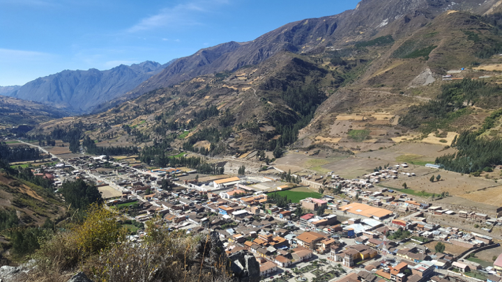

# About the Project

Chavín is a world-famous archaeological site (one of UNESCO’s World Heritage sites) dating back to 1300-500 BC, consisting of massive stone-and-mortar religious structures. The site is known for its precocious use of cut stone architecture and elaborate engraved stone art, as well as its extensive underground passageways and subterranean hydraulic system of drainage and supply canals. These and many other attributes of the site attract and fascinate visitors to the relatively remote highland Andes location. However, a major series of problems limit the ability to further develop the site. These problems include: severe threats to structural stability of major platform mounds; significant rainfall and water penetration during the wet season, seismic activity, clay mortar degradation, and collapse of exposed structures. This fellowship hopes to take advantage of Stanford engineering students’ interests and skills to add a new element to this technically-difficult conservation site and to come up with creative designs and implementation.
